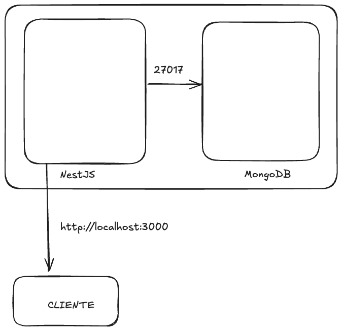

# Desafío 5

## Descripción del Problema
El desafío planteaba desarrollar una aplicación utilizando NestJS que se conecte a una base de datos MongoDB. Se requería configurar el entorno de desarrollo y producción mediante Docker y Docker Compose, garantizando la comunicación entre los servicios y el manejo adecuado de las variables de entorno.

## Solución Implementada
Implementé la solución de la siguiente manera:
- **Contenerización:** Se creó un Dockerfile para construir la imagen de la aplicación NestJS y se definió un archivo docker-compose.yaml para orquestar la solución.
- **Base de Datos:** Se utilizó una imagen oficial de MongoDB extraída de DockerHub para el contenedor de la base de datos, que escucha en el puerto 27017. Además, se asigna un volumen para la persistencia de datos.
- **Conexión entre Contenedores:** Los contenedores (el de NestJS, denominado "app", y el de MongoDB, denominado "db") están conectados mediante un Docker network. La aplicación se conecta a MongoDB a través del puerto 27017 usando el username "root" y el password "password".
- **Verificación de Conexión:** Dentro de la aplicación NestJS se realizó una llamada a MongoDB para comprobar la conexión, cuyo resultado se refleja al acceder al http://localhost:3000.

## Cómo Usarlo
1. Verifica que tienes instalados Docker y Docker Compose.
2. Ubícate en la carpeta donde se encuentra `docker-compose.yaml`.
3. Ejecuta el siguiente comando para construir y levantar los contenedores de forma desatendida:
   - docker compose up -d --build
4. La aplicación se expone en el puerto 3000 (mapeado desde el contenedor al host), así que podrás acceder a ella mediante:
   - http://localhost:3000
5. Para revisar los logs y confirmar la conexión a MongoDB, puedes ejecutar:
   - docker compose logs app

## Evidencias
- **Logs de la Aplicación:** 

- **Resultados en navegador** 

- **Terminal** 

## Diagrama

## Conclusión
Esta solución permite que la aplicación NestJS se conecte a MongoDB utilizando contenedores Docker que se comunican a través de una red definida. El mapeo de puertos (3000 para la aplicación y 27017 para MongoDB) junto con el uso de volúmenes para la persistencia de datos garantizan un entorno de desarrollo aislado y escalable para producción.

